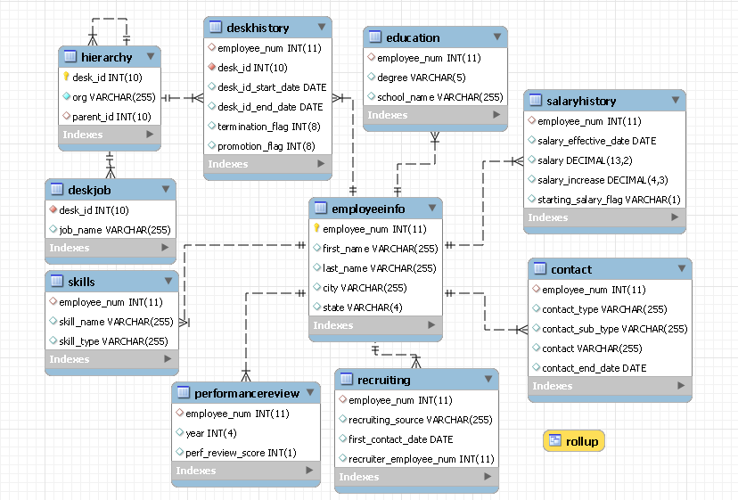

# sample-hr-database

FICTITIONAL Sample Human Resources database for a FICTITIONAL company.  Names, locations, etc are contrived and determined randomly when possible.

The results of this work can be found in two sources:
R package "hrsample" which can be found here:
https://github.com/harryahlas/hrsample

MySQL database.  See data folder for data dumps.

This data is useable but anticipate changes over time.  There are many issues that can be improved upon.  For instance, employees cannot get rehired. I plan to fix  that and others eventually.

Exercises related to this data can be found at my blog:
http://harry.ahlas.com

Reach me at twitter https://twitter.com/harry_ahlas

Built using R and MySQL.

Here is an EER diagram:

