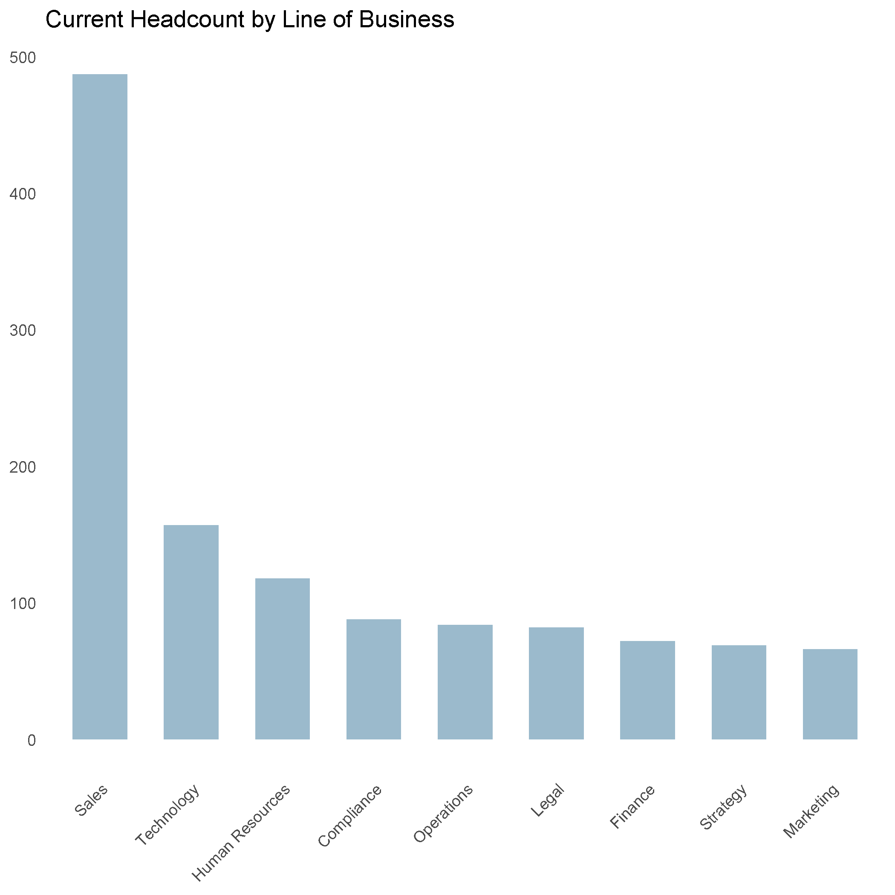
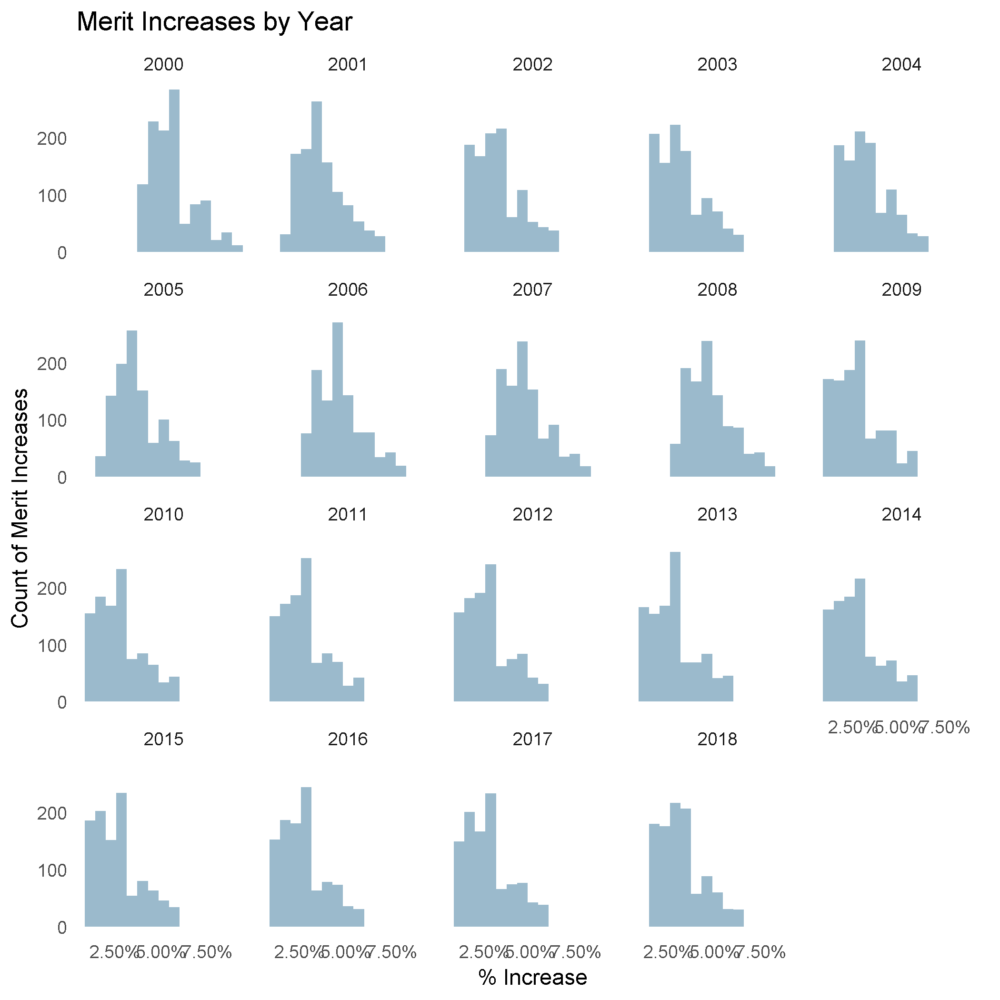
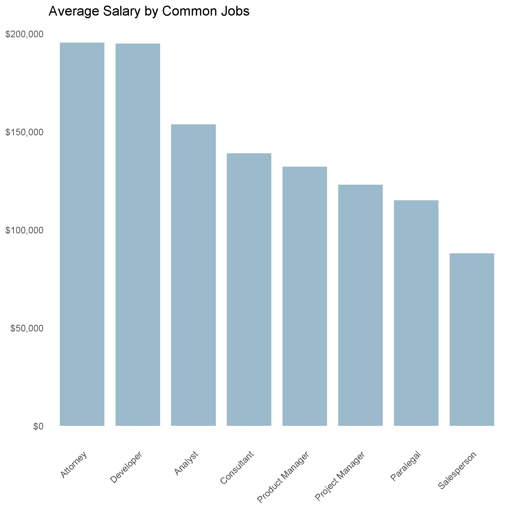

# sample-hr-database

FICTITIONAL Sample Human Resources database for a FICTITIONAL company.  Names, locations, etc are contrived and determined randomly when possible.

The results of this work can be found in two sources:
- R package "hrsample" which can be found here: https://github.com/harryahlas/hrsample
- MySQL database.  See data folder for data dumps.

This data is useable but anticipate changes over time.  There are many issues that can be improved upon.  For instance, employees cannot get rehired. There are an unusually high number of raises in 2018 due to a coding issue. I plan to fix  these and others eventually.

Built using R and MySQL.

Exercises related to this data can be found at my blog:
http://harry.ahlas.com

Images below, including an EER diagram, give you an idea of what is in the database.

For questions/comments reach me at twitter https://twitter.com/harry_ahlas

